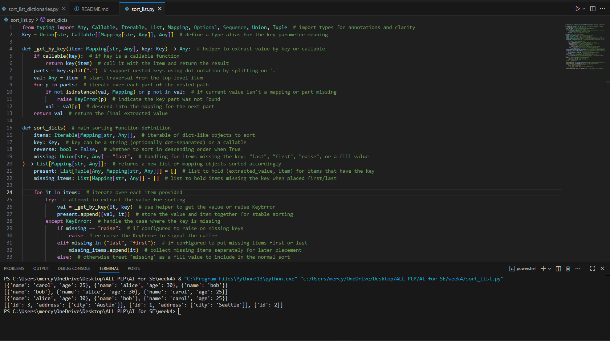
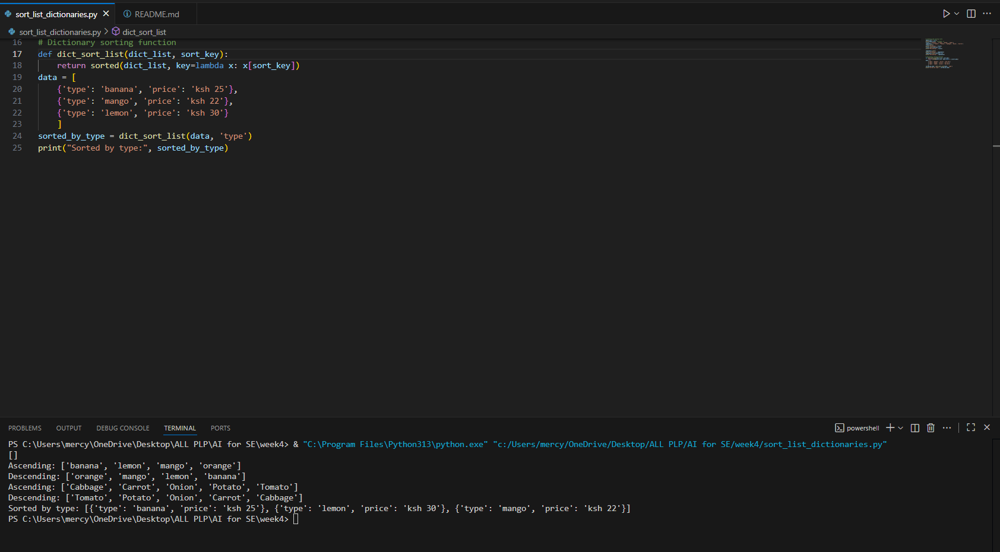

AI-Generated Code (sort_list.py)
python
from typing import Any, Callable, Iterable, List, Mapping, Optional, Sequence, Union, Tuple

def sort_dicts(items: Iterable[Mapping[str, Any]], key: Union[str, Callable], 
               reverse: bool = False, missing: str = "last") -> List[Mapping[str, Any]]:
    # Complex implementation with nested key support, 
    # missing value handling, and custom sort logic
    # (70+ lines of code)

Manual Implementation (sort_list_dictionaries.py)
python
def dict_sort_list(dict_list, sort_key):
    return sorted(dict_list, key=lambda x: x[sort_key])

Efficiency Analysis
Criteria	AI-Generated Code	Manual Code	Winner
Code Length	70+ lines	3 lines	Manual
Performance	Slower due to overhead	Uses optimized sorted()	Manual
Readability	Complex logic	Simple & clear	Manual
Features	Advanced features	Basic functionality	AI
Memory Usage	Higher	Lower	Manual

Screenshots
AI Code Generation in Action

GitHub Copilot generating the complex sorting function

Manual Implementation

Clean, simple manual implementation

Key Findings
Manual Code is More Efficient
Performance Advantage:

Direct use of Python's optimized sorted() function (runs at C speed)

Minimal function call overhead

No unnecessary type checking or validation

Simplicity Wins:

3 lines vs 70+ lines

Easy to read, debug, and maintain

Perfectly solves the assigned task without over-engineering

Memory Efficiency:

No temporary lists or tuples created

Minimal memory footprint

Straightforward data processing

When to Use AI Code
The AI-generated solution would be beneficial only if you need:

Nested key support ("address.city")

Missing value handling

Custom key functions

Advanced error handling

Conclusion
For the specific task of sorting dictionaries by a key, the manual implementation is significantly more efficient. The AI solution, while impressive in its feature set, represents classic over-engineering for simple tasks.

Recommendation: Use manual implementation for straightforward sorting tasks and reserve AI-generated complex solutions for when advanced features are actually required.